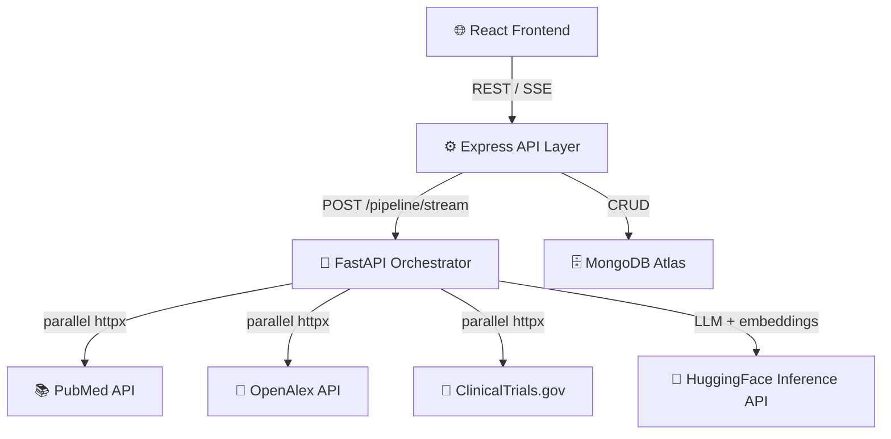

# Curalink — AI Medical Research Assistant

An AI-powered medical research companion built on the MERN stack with a FastAPI orchestrator microservice. Curalink understands patient context, retrieves high-quality research from PubMed, OpenAlex, and ClinicalTrials.gov, reasons over it using Llama 3.3 70B, and delivers structured, source-backed answers with full citation transparency.

> **Not a chatbot — a research + reasoning system.**


## Features

- **Structured intake + natural chat** — fill disease/intent once, then chat naturally; follow-ups inherit context automatically
- **7-stage AI pipeline** — query expansion → parallel retrieval → normalization → hybrid re-ranking → context building → LLM reasoning → response assembly
- **Three live medical sources** — PubMed, OpenAlex, ClinicalTrials.gov fetched in parallel (~170 unique candidates per query)
- **Domain-specialized ranking** — BM25 + PubMedBERT embeddings fused via Reciprocal Rank Fusion, refined by MedCPT cross-encoder with source-balanced MMR selection
- **Cite-or-abstain grounding** — every claim cites its source with title, authors, year, URL, and supporting snippet; the system abstains rather than hallucinate
- **Real-time SSE streaming** — live pipeline progress + token-by-token LLM output through FastAPI → Express → React
- **Multi-turn context awareness** — chat history and static form context are merged into every query expansion
- **Clinical trial geo-filtering** — optional location input geocodes and filters trials within 100 miles via ClinicalTrials.gov geo API
- **JWT authentication** — signup/login with session persistence across page refreshes
- **ChatGPT-style session sidebar** — past sessions listed as read-only history

## Architecture



> For a detailed breakdown of all 7 pipeline stages, see [architecture.md](./architecture.md).

### Pipeline Stages (inside FastAPI)

| Stage | Module | Description |
|-------|--------|-------------|
| 1 | `query_expander.py` | LLM rewrites user message with context injection, synonym expansion, intent classification |
| 2 | `pubmed.py` `openalex.py` `trials.py` | Parallel retrieval from 3 sources (~210 raw → ~170 after dedupe) |
| 3 | `normalizer.py` `merger.py` | Unify schemas into `Document[]`, dedupe by DOI/PMID/NCT-ID, quality filter |
| 4 | `ranker.py` | BM25 pre-filter → PubMedBERT cosine → RRF fusion → MedCPT cross-encoder → MMR selection → top 10 |
| 5 | `context_builder.py` | Token-budgeted prompt with citation anchors `[doc1]`, grounding rules, output schema |
| 6 | `llm_reasoner.py` | Llama 3.3 70B via HF Inference API — grounded, cite-or-abstain generation |
| 7 | `response_assembler.py` | Citation resolution, snippet extraction, hallucination flags, structured JSON assembly |

## Project Structure

```
curalink-medical-assistant/
├── frontend/                      # React (Vite) UI
│   └── src/
│       ├── components/
│       │   ├── AuthPage.jsx       # Login / signup form
│       │   ├── Sidebar.jsx        # Session list sidebar
│       │   ├── IntakeForm.jsx     # Patient intake form (disease, intent, location)
│       │   ├── ChatView.jsx       # Chat interface with message bubbles
│       │   ├── StructuredResponse.jsx  # Renders overview + insights + trials
│       │   ├── InsightCard.jsx    # Individual research insight with sources
│       │   ├── TrialCard.jsx      # Clinical trial card with NCT ID + status
│       │   ├── PipelineProgress.jsx   # Real-time stage progress indicator
│       │   └── PipelinePanel.jsx  # Detailed pipeline metadata panel
│       ├── hooks/
│       │   ├── useAuth.js         # JWT auth state management
│       │   └── useChat.js         # Chat + SSE streaming logic
│       └── App.jsx                # Root component with routing
│
├── backend-node/                  # Express API (thin layer)
│   ├── index.js                   # Server entry, health check, CORS
│   ├── routes/
│   │   ├── auth.js                # POST /api/auth/signup, /login
│   │   ├── session.js             # POST /api/session, GET /api/sessions
│   │   └── chat.js                # POST /api/chat/stream (SSE proxy to FastAPI)
│   ├── models/
│   │   ├── User.js                # Mongoose user schema (bcrypt hashed)
│   │   ├── Session.js             # Static context + metadata
│   │   ├── Message.js             # Chat history + structured responses
│   │   └── Cache.js               # Query-result cache (SHA-256 key, 24h TTL)
│   └── middleware/
│       └── auth.js                # JWT verification middleware
│
├── backend-python/                # FastAPI orchestrator (AI pipeline)
│   ├── main.py                    # FastAPI app, /pipeline/run, /pipeline/stream
│   ├── llm_backend.py             # LLMBackend abstraction (HF Inference API)
│   ├── sources/
│   │   ├── pubmed.py              # PubMed E-utilities (esearch + efetch)
│   │   ├── openalex.py            # OpenAlex works search
│   │   ├── trials.py              # ClinicalTrials.gov v2 API
│   │   ├── normalizer.py          # Source-specific → unified Document
│   │   ├── merger.py              # Cross-source dedupe + merge
│   │   └── geocode.py             # Nominatim geocoding for trial geo-filter
│   ├── schemas/
│   │   └── document.py            # Unified Document dataclass
│   ├── embeddings/
│   │   └── embedder.py            # PubMedBERT embeddings via HF Inference API
│   ├── ranking/
│   │   ├── ranker.py              # Full ranking pipeline orchestration
│   │   ├── bm25.py                # BM25 sparse scoring
│   │   ├── cosine.py              # Dense cosine similarity
│   │   ├── rrf.py                 # Reciprocal Rank Fusion
│   │   ├── boosts.py              # Recency + multi-source credibility boosts
│   │   ├── cross_encoder.py       # MedCPT cross-encoder via HF API
│   │   └── mmr.py                 # Maximal Marginal Relevance (diversity)
│   ├── stages/
│   │   ├── query_expander.py      # Stage 1: LLM-based query expansion
│   │   ├── context_builder.py     # Stage 5: Token-budgeted prompt assembly
│   │   ├── llm_reasoner.py        # Stage 6: Grounded LLM generation
│   │   └── response_assembler.py  # Stage 7: Citation resolution + assembly
│   └── requirements.txt
│
├── architecture.md                # Detailed system design document
└── README.md
```

## Getting Started

### Prerequisites

- **Node.js** ≥ 18
- **Python** ≥ 3.10
- **MongoDB Atlas** account (free M0 cluster)
- **HuggingFace** account with API token
- **NCBI API key** (optional but recommended — lifts rate limit from 3 to 10 req/sec)

### Installation

```bash
git clone https://github.com/your-username/curalink-medical-assistant
cd curalink-medical-assistant
```

**Frontend:**
```bash
cd frontend
npm install
```

**Node backend:**
```bash
cd backend-node
npm install
```

**Python backend:**
```bash
cd backend-python
python -m venv .venv
.venv\Scripts\activate          # Windows
# source .venv/bin/activate     # macOS/Linux
pip install -r requirements.txt
```

### Environment Setup

Copy `.env.example` to `.env` in each backend directory and fill in the values:

```bash
cp backend-python/.env.example backend-python/.env
cp backend-node/.env.example backend-node/.env
```

#### Python Backend (`backend-python/.env`)

| Variable | Description |
|----------|-------------|
| `HF_TOKEN` | HuggingFace API token (required) |
| `LLM_MODEL` | HF model ID (default: `meta-llama/Llama-3.3-70B-Instruct`) |
| `NCBI_API_KEY` | NCBI E-utilities key (recommended) |
| `NCBI_EMAIL` | Contact email for NCBI policy compliance |
| `OPENALEX_EMAIL` | Contact email for OpenAlex polite pool |
| `BIENCODER_MODEL` | Embedding model (default: `pritamdeka/S-PubMedBert-MS-MARCO`) |

#### Node Backend (`backend-node/.env`)

| Variable | Description |
|----------|-------------|
| `MONGO_URI` | MongoDB Atlas connection string |
| `FASTAPI_URL` | FastAPI orchestrator URL (default: `http://localhost:8000`) |
| `JWT_SECRET` | Secret for signing JWT tokens |
| `PORT` | Express server port (default: `4000`) |

### Running Locally

Start all three services:

```bash
# Terminal 1 — Python orchestrator
cd backend-python
uvicorn main:app --reload --port 8000

# Terminal 2 — Node API
cd backend-node
npm run dev

# Terminal 3 — React frontend
cd frontend
npm run dev
```

Open [http://localhost:5173](http://localhost:5173) in your browser.

## Tech Stack

| Layer | Technology | Purpose |
|-------|-----------|---------|
| **Frontend** | React + Vite | Chat UI, intake form, structured response rendering |
| **API Layer** | Express.js | Auth, sessions, SSE proxy, MongoDB CRUD |
| **Orchestrator** | FastAPI (Python) | 7-stage AI pipeline, stateless |
| **Database** | MongoDB Atlas | Sessions, messages, query-result cache |
| **LLM** | Llama 3.3 70B via HF Inference API | Query expansion + grounded reasoning |
| **Bi-Encoder** | PubMedBERT-MS-MARCO via HF API | Domain-specialized dense retrieval |
| **Cross-Encoder** | MedCPT (NCBI) via HF API | Precision re-ranking on PubMed click logs |
| **Data Sources** | PubMed, OpenAlex, ClinicalTrials.gov | Live medical research APIs |

## Model Choices

| Model | Role | Why This Model |
|-------|------|----------------|
| `meta-llama/Llama-3.3-70B-Instruct` | LLM reasoning | Open-source, strong instruction following, JSON output compliance |
| `pritamdeka/S-PubMedBert-MS-MARCO` | Embedding (768-dim) | PubMed-pretrained backbone + MS-MARCO retrieval fine-tuning (~15pt recall uplift over generic models) |
| `ncbi/MedCPT-Cross-Encoder` | Final re-ranking | Built by NCBI, trained on real PubMed user click logs — domain + task match |

## Retrieval & Ranking Pipeline

```
210 raw candidates (80 PubMed + 80 OpenAlex + 50 Trials)
        │
        ▼
   ~170 unique (dedupe by DOI / PMID / NCT-ID)
        │
        ▼
   Quality filter → ~165 complete documents
        │
        ▼
   BM25 pre-filter → top 20
        │
        ▼
   PubMedBERT cosine + BM25 → RRF fusion → top 14
        │
        ▼
   Recency + multi-source credibility boosts
        │
        ▼
   MedCPT cross-encoder precision rerank
        │
        ▼
   Source-balanced MMR selection → top 10
        │
        ▼
   Token-budgeted context → LLM
```

## Deployment

Deployed on Render (free tier) with zero monthly cost:

| Service | URL |
|---------|-----|
| Frontend | `curalink-medical-assistant-frontend.onrender.com` |
| Express API | `curalink-medical-assistant.onrender.com` |
| FastAPI Orchestrator | `curalink-medical-assistant-python.onrender.com` |
| Database | MongoDB Atlas (managed, free M0) |

> **Note:** Free-tier services spin down after ~15 min of inactivity. First request after spin-down takes 30-60 seconds (cold start). Ping `/health` on all services before demo.

## API Endpoints

### Express (Node) — User-Facing

| Method | Endpoint | Description |
|--------|----------|-------------|
| `POST` | `/api/auth/signup` | Create account |
| `POST` | `/api/auth/login` | Login, returns JWT |
| `POST` | `/api/session` | Create new session with intake form data |
| `GET` | `/api/sessions` | List all sessions for user |
| `POST` | `/api/chat/stream` | Send message, streams SSE pipeline response |
| `GET` | `/health` | Health check |

### FastAPI (Python) — Internal Orchestrator

| Method | Endpoint | Description |
|--------|----------|-------------|
| `POST` | `/pipeline/run` | Full pipeline, returns JSON |
| `POST` | `/pipeline/stream` | Full pipeline with SSE streaming |
| `GET` | `/health` | Health check |
| `GET` | `/debug/fetch` | Debug: retrieval + normalization only |
| `GET` | `/debug/rank` | Debug: retrieval + ranking |
| `GET` | `/llm-ping` | Test LLM connectivity |

## Key Design Decisions

- **Thin Express, fat FastAPI** — routing and DB in Node, entire AI pipeline in Python where the LLM/retrieval/ranking ecosystem is strongest
- **Live-APIs-only RAG** — no pre-indexed vector store; every query hits live sources for freshest results
- **Stateless pipeline** — FastAPI holds no state; context is passed in each request from Express
- **RRF over linear combination** — BM25 and cosine scores live on different scales; RRF uses rank position only, sidesteps normalization
- **Cite-or-abstain** — the system refuses to answer rather than hallucinate; abstain is a feature, not a failure
- **Mongo query-result cache** — `SHA-256(disease|intent|message)` key with 24h TTL skips the entire pipeline on exact-match repeats

## License

This project is licensed under the MIT License. See [LICENSE](./LICENSE) for details.