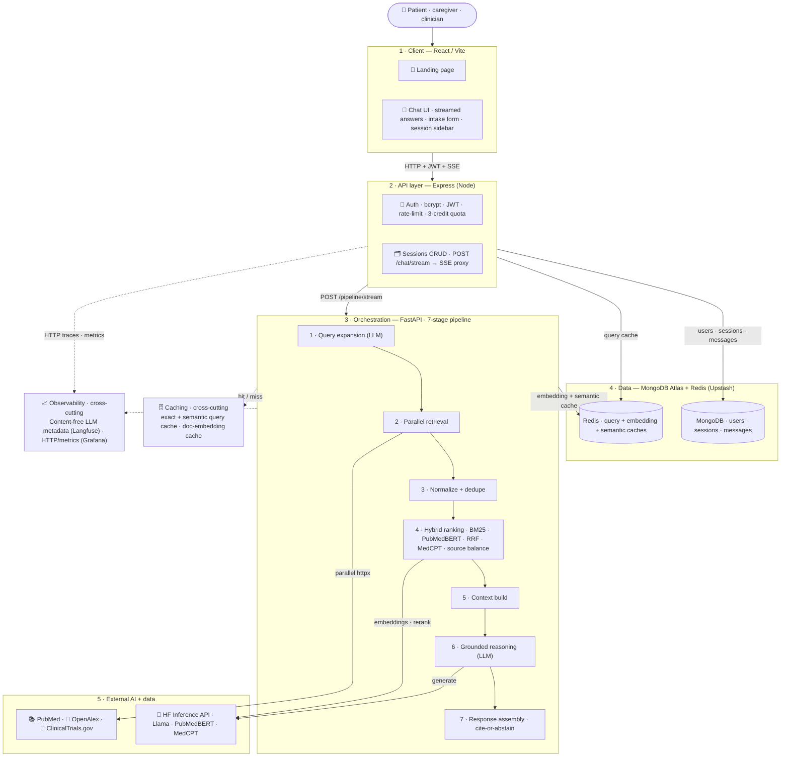

# Curalink — AI Medical Research Assistant

An AI-powered medical research companion built on the MERN stack with a FastAPI orchestrator microservice. Curalink uses de-identified patient context to retrieve research from PubMed, OpenAlex, and ClinicalTrials.gov, reasons over it with a configurable LLM (HuggingFace Inference API or Cloudflare Workers AI), and delivers structured answers with sources users can inspect.

## Features

- **Structured intake + natural chat** — fill disease/intent once, then chat naturally; follow-ups inherit context automatically
- **7-stage AI pipeline** — query expansion → parallel retrieval → normalization → hybrid re-ranking → context building → LLM reasoning → response assembly
- **Three current medical sources** — cache misses query PubMed, OpenAlex, and ClinicalTrials.gov in parallel (~170 unique candidates per query)
- **Domain-specialized ranking** — BM25 + PubMedBERT embeddings fused via Reciprocal Rank Fusion, refined by a MedCPT cross-encoder with source-balanced selection
- **Inspectable sources** — research findings and personalized recommendations include titles, authors, years, URLs, and supporting excerpts for verification against the original publications
- **Emergency boundary** — urgent-use messages are diverted from the research pipeline to immediate emergency-services guidance
- **Real-time SSE streaming** — live pipeline progress + token-by-token LLM output through FastAPI → Express → React
- **Multi-turn context awareness** — chat history and static form context are merged into every query expansion
- **Clinical trial geo-filtering** — optional location input geocodes and filters trials within 100 miles via ClinicalTrials.gov geo API
- **Privacy controls** — de-identified-use policy, 90-day session/message retention, per-session deletion, and complete account deletion from the UI
- **Tab-scoped sessions** — login lives only in the current browser tab (`sessionStorage`); closing the tab logs out, 1-hour access tokens renew automatically while the tab is open, and logout revokes renewal tokens
- **Bring your own API keys** — a Settings popup accepts the user's own Hugging Face token (plus a Cloudflare account ID and token when Cloudflare is the LLM provider); keys are verified with the provider, kept only in the browser tab, and then power every AI stage, so daily credits are hidden and those questions never count against the free limit
- **ChatGPT-style session sidebar** — click any past session to reopen it and keep asking; new messages append to that session's history
- **Landing page** — two-column hero with the pitch and sign-up on the left, and the animated research demo plus headline metrics (scope-routing accuracy, citation coverage, p95 API latency) on the right
- **Responsive authenticated UI** — collapsed mobile navigation and diagnostics overlays verified at 390px and 430px widths
- **Private service boundary** — a shared `INTERNAL_API_KEY` protects non-health FastAPI endpoints from direct public use
- **Redis caching** — tenant-isolated exact + semantic query caches and a document-embedding cache on Upstash, with a Mongo query-cache fallback
- **Per-user credits + rate limiting** — 5 questions/day (DAILY_MESSAGE_CAP) on platform keys, waived for users who bring their own keys, plus per-IP / per-user limits on auth, chat, and session creation
- **Observability** — content-free LLM metadata to Langfuse plus HTTP spans and metrics to Grafana over OTLP
- **CI/CD + Docker** — GitHub Actions (lint, unit tests, syntax, build, image builds, gated Render deploy) and Dockerfiles for all three services

## 🏗️ Architecture

Five layers, read top to bottom. Each arrow is a hand-off between layers; the
shared services (data, external AI) are reached per layer rather than by every
stage, so the flow stays legible. Caching and observability are cross-cutting.


```mermaid
graph TD
    User(["👤 Patient · caregiver · clinician"])

    subgraph CLIENT ["1 · Client — React / Vite"]
        Land["🛬 Landing page"]
        UI["💬 Chat UI · streamed answers · intake form · session sidebar"]
    end

    subgraph API ["2 · API layer — Express (Node)"]
        Auth["🔐 Auth · bcrypt · JWT · rate-limit · 3-credit quota"]
        REST["🗂️ Sessions CRUD · POST /chat/stream → SSE proxy"]
    end

    subgraph ORCH ["3 · Orchestration — FastAPI · 7-stage pipeline"]
        S1["1 · Query expansion (LLM)"]
        S2["2 · Parallel retrieval"]
        S3["3 · Normalize + dedupe"]
        S4["4 · Hybrid ranking · BM25 · PubMedBERT · RRF · MedCPT · source balance"]
        S5["5 · Context build"]
        S6["6 · Grounded reasoning (LLM)"]
        S7["7 · Response assembly · cite-or-abstain"]
        S1 --> S2 --> S3 --> S4 --> S5 --> S6 --> S7
    end

    subgraph DATA ["4 · Data — MongoDB Atlas + Redis (Upstash)"]
        Mongo[("MongoDB · users · sessions · messages")]
        Redis[("Redis · query + embedding + semantic caches")]
    end

    subgraph EXT ["5 · External AI + data"]
        HF["🤗 HF Inference API · Llama · PubMedBERT · MedCPT"]
        Src["📚 PubMed · 🔬 OpenAlex · 🧪 ClinicalTrials.gov"]
    end

    Cache["🗄️ Caching · cross-cutting<br>exact + semantic query cache · doc-embedding cache"]
    OBS["📈 Observability · cross-cutting<br>Content-free LLM metadata (Langfuse) · HTTP/metrics (Grafana)"]

    User --> CLIENT
    CLIENT -->|HTTP + JWT + SSE| API
    API -->|users · sessions · messages| Mongo
    API -->|query cache| Redis
    API -->|POST /pipeline/stream| ORCH
    S2 -->|parallel httpx| Src
    S4 -->|embeddings · rerank| HF
    S6 -->|generate| HF
    ORCH -->|embedding + semantic cache| Redis
    ORCH -.->|hit / miss| Cache
    API -.->|HTTP traces · metrics| OBS
    ORCH -.->|LLM traces| OBS
```

> For a detailed breakdown of all 7 pipeline stages, see [architecture.md](./architecture.md).

### Pipeline Stages (inside FastAPI)

| Stage | Module | Description |
|-------|--------|-------------|
| 1 | `query_expander.py` | LLM rewrites user message with context injection, synonym expansion, intent classification |
| 2 | `pubmed.py` `openalex.py` `trials.py` | Parallel retrieval from 3 sources (~210 raw → ~170 after dedupe) |
| 3 | `normalizer.py` `merger.py` | Unify schemas into `Document[]`, dedupe by DOI/PMID/NCT-ID, quality filter |
| 4 | `ranker.py` | BM25 pre-filter → PubMedBERT cosine → RRF fusion → MedCPT cross-encoder → source-balanced top 14 |
| 5 | `context_builder.py` | Token-budgeted prompt with citation anchors `[doc1]`, grounding rules, output schema |
| 6 | `llm_reasoner.py` | Llama 3.3 70B via HF Inference API — source-constrained structured generation |
| 7 | `response_assembler.py` | Citation resolution, snippet extraction, hallucination flags, structured JSON assembly |

## Project Structure

```
curalink-medical-assistant/
├── frontend/                      # React (Vite) UI
│   └── src/
│       ├── components/
│       │   ├── AuthPage.jsx       # Login / signup form
│       │   ├── Sidebar.jsx        # Session list sidebar
│       │   ├── IntakeForm.jsx     # De-identified patient context (disease, intent, general location)
│       │   ├── LegalPage.jsx      # Privacy notice + terms of use
│       │   ├── ApiKeySettings.jsx # Own-API-key settings popup
│       │   ├── ChatView.jsx       # Chat interface with message bubbles
│       │   ├── StructuredResponse.jsx  # Renders overview + insights + trials
│       │   ├── InsightCard.jsx    # Individual research insight with sources
│       │   ├── TrialCard.jsx      # Clinical trial card with NCT ID + status
│       │   ├── PipelineProgress.jsx   # Real-time stage progress indicator
│       │   └── PipelinePanel.jsx  # Detailed pipeline metadata panel
│       ├── hooks/
│       │   ├── useAuth.js         # JWT auth state management
│       │   └── useChat.js         # Chat + SSE streaming logic
│       ├── session.js             # Tab-scoped tokens, token renewal, own-key headers
│       └── App.jsx                # Root component with routing
│
├── backend-node/                  # Express API (thin layer)
│   ├── index.js                   # Server entry, health check, CORS
│   ├── own_keys.js                # Validates and forwards user-supplied provider keys
│   ├── routes/
│   │   ├── auth.js                # Signup, login, token refresh, logout, current user
│   │   ├── session.js             # POST /api/session, GET /api/sessions
│   │   └── chat.js                # POST /api/chat/stream (SSE proxy to FastAPI)
│   ├── models/
│   │   ├── User.js                # Mongoose user schema (bcrypt hashed)
│   │   ├── Session.js             # Static context + metadata
│   │   ├── Message.js             # Chat history + structured responses
│   │   └── Cache.js               # Tenant-isolated query-response cache fallback (24h TTL)
│   └── middleware/
│       └── auth.js                # JWT verification middleware
│
├── backend-python/                # FastAPI orchestrator (AI pipeline)
│   ├── main.py                    # FastAPI app, /pipeline/run, /pipeline/stream
│   ├── own_keys.py                # Verifies user-supplied provider keys
│   ├── llm_backend.py             # LLMBackend abstraction (HF Inference API)
│   ├── sources/
│   │   ├── pubmed.py              # PubMed E-utilities (esearch + efetch)
│   │   ├── openalex.py            # OpenAlex works search
│   │   ├── trials.py              # ClinicalTrials.gov v2 API
│   │   ├── normalizer.py          # Source-specific → unified Document
│   │   ├── merger.py              # Cross-source dedupe + merge
│   │   └── geocode.py             # Nominatim geocoding for trial geo-filter
│   ├── schemas/
│   │   └── document.py            # Unified Document dataclass
│   ├── embeddings/
│   │   └── embedder.py            # PubMedBERT embeddings via HF Inference API
│   ├── ranking/
│   │   ├── ranker.py              # Full ranking pipeline orchestration
│   │   ├── bm25.py                # BM25 sparse scoring
│   │   ├── cosine.py              # Dense cosine similarity
│   │   ├── rrf.py                 # Reciprocal Rank Fusion
│   │   ├── boosts.py              # Recency + multi-source credibility boosts
│   │   ├── cross_encoder.py       # MedCPT cross-encoder via HF API
│   │   └── mmr.py                 # Maximal Marginal Relevance (diversity)
│   ├── stages/
│   │   ├── query_expander.py      # Stage 1: LLM-based query expansion
│   │   ├── context_builder.py     # Stage 5: Token-budgeted prompt assembly
│   │   ├── llm_reasoner.py        # Stage 6: Grounded LLM generation
│   │   └── response_assembler.py  # Stage 7: Citation resolution + assembly
│   └── requirements.txt
│
├── architecture.md                # Detailed system design document
└── README.md
```

## Getting Started

### Prerequisites

- **Node.js** ≥ 18
- **Python** ≥ 3.10
- **MongoDB Atlas** account (free M0 cluster)
- **HuggingFace** account with API token
- **NCBI API key** (optional but recommended — lifts rate limit from 3 to 10 req/sec)

### Installation

```bash
git clone https://github.com/your-username/curalink-medical-assistant
cd curalink-medical-assistant
```

**Frontend:**
```bash
cd frontend
npm install
```

**Node backend:**
```bash
cd backend-node
npm install
```

**Python backend:**
```bash
cd backend-python
python -m venv .venv
.venv\Scripts\activate          # Windows
# source .venv/bin/activate     # macOS/Linux
pip install -r requirements.txt
```

### Environment Setup

Copy `.env.example` to `.env` in each backend directory and fill in the values:

```bash
cp backend-python/.env.example backend-python/.env
cp backend-node/.env.example backend-node/.env
```

#### Python Backend (`backend-python/.env`)

| Variable | Description |
|----------|-------------|
| `LLM_MODEL` | **Required.** `CLOUDFLARE` or a HuggingFace model id (e.g. `meta-llama/Llama-3.1-8B-Instruct`) |
| `INTERNAL_API_KEY` | **Required.** Shared secret for authenticated Express → FastAPI calls |
| `HF_TOKEN` | HuggingFace API token (when `LLM_MODEL` is a HF model id) |
| `CLOUDFLARE_ACCOUNT_ID` | CF account ID (when `LLM_MODEL=CLOUDFLARE`) |
| `CLOUDFLARE_API_TOKEN` | CF API token (when `LLM_MODEL=CLOUDFLARE`) |
| `NCBI_API_KEY` | NCBI E-utilities key (recommended) |
| `NCBI_EMAIL` | Contact email for NCBI policy compliance |
| `OPENALEX_EMAIL` | Contact email for OpenAlex polite pool |
| `BIENCODER_MODEL` | Embedding model (default: `pritamdeka/S-PubMedBert-MS-MARCO`) |

#### Node Backend (`backend-node/.env`)

| Variable | Description |
|----------|-------------|
| `MONGO_URI` | MongoDB Atlas connection string |
| `FASTAPI_URL` | FastAPI orchestrator URL (default: `http://localhost:8000`) |
| `JWT_SECRET` | Secret for signing JWT tokens |
| `INTERNAL_API_KEY` | **Required.** Same shared secret configured on FastAPI |
| `ALLOWED_ORIGINS` | Comma-separated CORS allow-list of frontend origins (default: deployed frontend + `localhost:5173`) |
| `PORT` | Express server port (default: `4000`) |

### Running Locally

Start all three services:

```bash
# Terminal 1 — Python orchestrator
cd backend-python
uvicorn main:app --reload --port 8000

# Terminal 2 — Node API
cd backend-node
npm run dev

# Terminal 3 — React frontend
cd frontend
npm run dev
```

Open [http://localhost:5173](http://localhost:5173) in your browser.

## Tech Stack

| Layer | Technology | Purpose |
|-------|-----------|---------|
| **Frontend** | React + Vite | Responsive research chat, de-identified intake, structured source rendering |
| **API Layer** | Express.js | Auth, tenant isolation, sessions, SSE proxy, MongoDB CRUD |
| **Orchestrator** | FastAPI (Python) | 7-stage AI pipeline, stateless |
| **Database** | MongoDB Atlas | Accounts, consent, sessions, messages, query-cache fallback |
| **LLM** | HF Inference API or Cloudflare Workers AI | Query expansion + grounded reasoning (multi-provider) |
| **Bi-Encoder** | PubMedBERT-MS-MARCO via HF API | Domain-specialized dense retrieval |
| **Cross-Encoder** | MedCPT (NCBI) via HF API | Precision re-ranking on PubMed click logs |
| **Data Sources** | PubMed, OpenAlex, ClinicalTrials.gov | Live medical research APIs |

## Model Choices

| Model | Role | Why This Model |
|-------|------|----------------|
| `meta-llama/Llama-3.3-70B-Instruct` | LLM reasoning | Open-source, strong instruction following, JSON output compliance |
| `pritamdeka/S-PubMedBert-MS-MARCO` | Embedding (768-dim) | PubMed-pretrained backbone + MS-MARCO retrieval fine-tuning (~15pt recall uplift over generic models) |
| `ncbi/MedCPT-Cross-Encoder` | Final re-ranking | Built by NCBI, trained on real PubMed user click logs — domain + task match |

## Retrieval & Ranking Pipeline

```
210 raw candidates (80 PubMed + 80 OpenAlex + 50 Trials)
        │
        ▼
   ~170 unique (dedupe by DOI / PMID / NCT-ID)
        │
        ▼
   Quality filter → ~165 complete documents
        │
        ▼
   BM25 pre-filter → top 20
        │
        ▼
   PubMedBERT cosine + BM25 → RRF fusion → top 14
        │
        ▼
   Recency + multi-source credibility boosts
        │
        ▼
   MedCPT cross-encoder precision rerank
        │
        ▼
   Source-balanced publication/trial selection → top 14
        │
        ▼
   Token-budgeted context → LLM
```

## Deployment

Deployed on Render (free tier) with zero monthly cost:

| Service | URL |
|---------|-----|
| Frontend | `curalink-medical-assistant-frontend.onrender.com` |
| Express API | `curalink-medical-assistant.onrender.com` |
| FastAPI Orchestrator | `curalink-medical-assistant-python.onrender.com` |
| Database | MongoDB Atlas (managed, free M0) |

> **Note:** Free-tier services spin down after ~15 min of inactivity. First request after spin-down takes 30-60 seconds (cold start). Ping `/health` on all services before demo.

## API Endpoints

### Express (Node) — User-Facing

| Method | Endpoint | Description |
|--------|----------|-------------|
| `POST` | `/api/auth/signup` | Create account |
| `POST` | `/api/auth/login` | Login, returns JWT |
| `POST` | `/api/session` | Create new session with intake form data |
| `GET` | `/api/sessions` | List all sessions for user |
| `POST` | `/api/chat/stream` | Send message, streams SSE pipeline response |
| `GET` | `/health` | Health check |

### FastAPI (Python) — Internal Orchestrator

| Method | Endpoint | Description |
|--------|----------|-------------|
| `POST` | `/pipeline/run` | Full pipeline, returns JSON |
| `POST` | `/pipeline/stream` | Full pipeline with SSE streaming |
| `GET` | `/health` | Health check |
| `GET` | `/debug/fetch` | Debug: retrieval + normalization only |
| `GET` | `/debug/rank` | Debug: retrieval + ranking |
| `GET` | `/llm-ping` | Test LLM connectivity |

## Load Testing & Capacity

`backend-node/load_test.py` answers two questions: does the app stay responsive under load, and how many concurrent users it takes. The LLM is stubbed (zero HF cost), so a run finishes in minutes.

**Capacity** (`--ramp`, local, pipeline stubbed). Scales read concurrency through 10→300 users:

| Concurrent users | req/s | p50 | p95 | errors |
|---|---|---|---|---|
| 10 | 32.9 | 234ms | 890ms | 0 |
| 25 | 58.4 | 313ms | 1.0s | 0 |
| **50** | **77.8** | **484ms** | **1.4s** | **0** |
| 100 | 63.9 | 860ms | 5.0s | 0 |
| 200 | 53.5 | 1.3s | 6.8s | 0 |
| 300 | 63.5 | 4.3s | 6.4s | 0 |

**Zero errors even at 300 concurrent users.** Estimated healthy ceiling: **~50 users** (SLO: <1% errors AND p95 < 3× the 10-user baseline). Above 50 latency degrades but nothing breaks.

**Responsiveness** (idle vs saturated, 20 read clients + 12 chat streams). `/health` barely moves — **p95 31→32ms (×1.0)** — so chat streaming doesn't starve the event loop. DB-hitting reads actually get *faster* under saturation (warm caches): sessions **p95 891→422ms (×0.5)**, session detail **p95 1703→703ms (×0.4)**. **0 errors** in both phases.

**Production (Render free tier)** (`--ramp --base-url https://curalink-medical-assistant.onrender.com`):

| Concurrent users | req/s | p50 | p95 | errors |
|---|---|---|---|---|
| 10 | 27.4 | 313ms | 594ms | 0 |
| 25 | 48.1 | 437ms | 938ms | 0 |
| **50** | **55.8** | **797ms** | **1.6s** | **0** |
| 100 | 66.0 | 1.5s | 2.3s | 0 |
| 200 | 71.3 | 3.0s | 4.0s | 0 |
| 300 | 47.1 | 4.5s | 11.1s | 0 |

**3,170 requests, 0 errors.** Same ~50 user ceiling. Render adds ~100-200ms network overhead vs local, but zero errors all the way to 300.

Headline figure: **2.3 s p95 API latency at 100 concurrent users** on Render production. This measures the Express API with the AI pipeline stubbed, not time to a research answer.

**Bottom line:** one Express instance serves ~50 concurrent browsers with no failures, both locally and on Render free tier. To go further the next levers are a paid always-on tier, horizontal scaling, and a read replica (Part 4 of the roadmap).

```bash
cd backend-node
python load_test.py --ramp              # concurrency ceiling
python load_test.py                      # idle vs saturated
python load_test.py --smoke              # quick functional check
python load_test.py --selftest           # CI smoke test (no servers)
```

## Pipeline Quality Evaluation

`backend-python/eval_harness.py` runs 50 medical queries (plus 8 should-abstain queries) against the live FastAPI pipeline and scores each response on 7 automated checks. Uses the HF free tier — $0 cost.

### Results (Llama-3.3-70B-Instruct, 2026-09-03)

**47/50 queries passed all checks (94%)** — 2 failures from stale cache, 1 from HF timeout. Effective pass rate on fresh queries: **98%**.

| Check | Pass Rate | Description |
|-------|-----------|-------------|
| Scope-routing accuracy (`abstain_correct`) | 98% (49/50) | Declines non-medical queries and answers medical ones |
| `has_overview` | 98% (41/42) | Response includes an overview paragraph |
| `has_structure` | 98% (41/42) | Response has required top-level keys |
| `min_trials_met` | 98% (41/42) | ≥1 clinical trial returned |
| `topic_hit` | 98% (41/42) | Response addresses the queried topic |
| `min_insights_met` | 93% (39/42) | ≥2 research insights with sources |
| Citation coverage (`citations_grounded`) | 93% (39/42) | Every insight is linked to a titled source (presence check, not entailment) |

**Retrieval:** avg 6.4 insights/query, 5.7 trials/query, 656 resolved citation references. This structural metric does not verify that every claim is medically correct or entailed by its source.

**Latency (medical queries):** avg 46s, p50 34s, p95 114s (dominated by ranking + LLM stages on free-tier rate limits).

### Commands

```bash
cd backend-python

# Full 50-query eval (needs FastAPI on :8000, hits real LLM — $0 on free tier)
python eval_harness.py

# Single query by index
python eval_harness.py --query 0

# Validate eval set only (no server needed)
python eval_harness.py --selftest
```

## Key Design Decisions

- **Thin Express, fat FastAPI** — routing and DB in Node; retrieval, ranking, and generation in Python
- **Live-source RAG on cache misses** — uncached queries retrieve current PubMed, OpenAlex, and ClinicalTrials.gov records; tenant-isolated caches accelerate repeats
- **Stateless pipeline** — FastAPI holds no request state; context is passed in each request from Express
- **RRF over linear combination** — BM25 and cosine scores live on different scales; RRF uses rank position only, sidesteps normalization
- **Cite-or-abstain intent** — prompts instruct the model to cite retrieved documents and abstain when they are insufficient; users must still verify the original sources
- **Tenant-isolated result cache** — `query:<userId>:SHA-256(user|disease|intent|location|message|history)` with 24h TTL and Redis-to-Mongo fallback
- **Public-beta boundary** — de-identified research assistance only; no diagnosis, prescribing, treatment selection, trial-eligibility determination, or emergency assessment

## 📜 License

MIT License

This project is licensed under the MIT License. See [LICENSE](./LICENSE) for details.